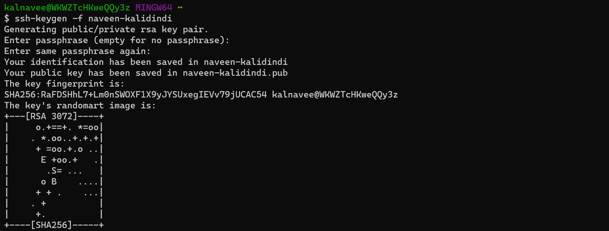
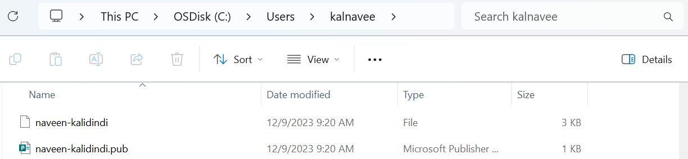
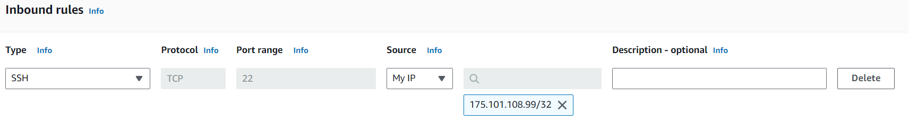

### computer
```
OS + RAM + Storage + CPU && It Should has IP address

Based on purpose we call them with different names
_> Mobile __> Calling
_> Laptop __> Internet,Browsing,Watching Movies
_> Server __> Install Applications & Serve User's Request's
```
```
Windows have graphics = Consume More Memory, CPU, RAM
Linux don't have graphics = Consume Less Memory,CPU, RAM

Why OS??
OS is bridge between user & Hardware
kernel + shell = Linux

User -- commands -- 0/1 -- Hardware
Application -- shell -- kernal -- Hardware

Kernel – Heart of OS, interacts with Hardware
Shell – takes inputs from user & pass to kernel

UNIX → Not portable (tightly coupled with hardware), costly, but secure
LINUX → portable, secure (based on UNIX principles), written in c language
kernel + shell = Linux
```
```
why Linux??
  → open source
  → Less cost
  → More performance
  → Highly Stable
  → Low power

More utilities → Ubuntu, Fedora, Centos
kernel + Shell + graphics = Android, Ubuntu Desktop
kernel + Shell + some utilities = server

RHEL – License + Support
CentOS – Free + community support
Amazon Linux – Free + community support

Ubuntu – Free + community support

→ *** ← APT  (Debian/Ubuntu)
→ *** ← YUM  (Fedora/RHEL/Amazon Linux/CentOS)
```
### Authentication Vs Authorization
```
Authentication ..> Provide Access Resource's
Ex: Login to AWS Console

Authorization ..> What Actions you can perform inside Resource's
Ex: Create EC2, RDS, Security Groups, Key-Pair's
```
### Ways to Connect to Linux Server → Authentication 
```
→ What you know →→ username, password
→ What you have →→ PAT tokens, keys
→ what you are →→ fingerprint, palms,retina etc..

Need to have Protocol, Port, Username, Password/Private-Key

Authentication Should be done with help of Keys
- Linux Server has Public Key
- User has Private Key
```
### Protocols & Ports
```
- Open google.com with HTTP/HTTPS     ..> Public Access ..> Users
- Connect to google servers with SSH  ..> Private Access ..> Developers

HTTP: 80
HTTPS: 443
SSH: 22
RDP: 3389

No of Ports for Server? 65536 ..> 0 to 65535
```
### we use token to Connect to Linux Server's
```
public key  ..> server
private key ..> client

we can generate key??
ssh-keygen -f <file-name>
ex: ssh-keygen -f naveen-kalidindi

public key format
ssh-rsa/ed25519 <random-code> laptop-username@laptop-name
ed25519 ..> Algorithm used to Generate Keys
rsa     ..> Algorithm used to Generate Keys

it will generate 2 files
naveen-kalidindi     ..> private key ..> rename to naveen-kalidindi.pem
naveen-kalidindi.pub ..> public key
```



### Import Key-Pair
```
EC2 Dashboard -- Key-Pair -- Import Key-Pair -- copy paste public key -- save
```
### Create Security-Group to allow traffic → My IP
```
- Get IP from cmd ..> curl ifcfg.me  //This Public IP Changes Every-time when PC Restart
- Allow all traffic from My IP to AWS
```



### Create Linux Server
```
- Create Linux Server with Above Created Key-Pair, Security-Group
```
### Login into EC2 Server
```
ssh -i naveen-kalidindi.pem ec2-user@xx.xx.xx.xx
```
```
$ -- Normal user
# -- Root user

Normal user to Root user
sudo su - 
sudo su 
sudo -i 

pwd -- present working directory
cd -- change directory
history -- show command history
```
### Linux Kernel
```
uname     -- name of kernel
uname -a  -- Info of kernel
```
### List Command
```
ls        -- list files
ls -l     -- list files in length format, a-z order
ls -lt    -- recently accessed files at top
ls -lr    -- z-a order
ls -lrt   -- recently accessed files at last
ls -la    -- show hidden files
```
### CRUD commands → File's
```
C ..> touch f1.txt, vi f1.txt, cat > f1.txt .... ctrl+d
R ..> cat f1.txt
U ..> vi f1.txt 
D ..> rm f1.txt

cat > f1.txt .... ctrl+d
>  ..> override text
>> ..> append text
```
### CRUD commands → Directory's
```
C ..> mkdir nk-tt 
R ..> ls
U ..> mv nk-tst nk-tst2, cp nk-tst nk-tst3
D ..> rmdir nk-tt
```
### CRUD commands
```
create a new file
  touch f1.txt
  touch f2.txt
  ls
  f1.txt f2.txt

create a new folder
  mkdir devops
  ls
  f1.txt f2.txt devops

Add data to file
  cat > f1.txt // (modify content every time) open f1.txt, enter ctr+d to save
  cat >> f1.txt // Append content to file

remove file
  rm f1.txt

remove folder
  rm -rf devops  // -r recursively, -f forceful 
  --OR--
  rm -r devops
  --OR--
  rmdir devops // remove only if directory is empty
```
### head & tail
```
head f1.txt // first 10 lines
head f1.txt -n 2 // first 2 lines
tail f2.txt // last 10 lines
tail f2.txt -n 2 // last 2 lines

less f2.txt // show entire file
shift + g ..> go down
gg ..> go up
q ..> quit
```
### Search in file??
Note: Linux is by default case sensitive
```
grep root /etc/passwd

grep -i root /etc/passwd    //ignore case sensitive

cat /etc/passwd | grep root  //we are using piping (o/p stage given as i/p to next stage)
```
### curl vs wget
```
wget <URL> ..> wget = World Wide Web Get
curl <URL> ..> curl = client URL

wget -- download files
curl -- download text content directly to terminal
we can use curl as wget
Ex: curl -o /tmp/web.zip https://roboshop-builds.s3.amazonaws.com/web.zip
```
### cut vs awk
```
http://localhost:8080/login?from=%2F

delimiter
: -- http,//localhost,8080/login?from=%2F
/ -- http:,,localhost:8080,login?from=%2F

cut
---
echo http://localhost:8080/login?from=%2F | cut -d : -f1
http
echo http://localhost:8080/login?from=%2F | cut -d : -f2
//localhost
```
### awk
#### Note:: we can cut column wise too with awk command
```
echo http://localhost:8080/login?from=%2F | awk -F / '{print $1F}'
http:

echo http://localhost:8080/login?from=%2F | awk -F / '{print $2F}'

echo http://localhost:8080/login?from=%2F | awk -F / '{print $NF}'
login?from=%2F

cat /etc/passwd
  root:x:0:0:Super User:/root:/bin/bash
  bin:x:1:1:bin:/bin:/usr/sbin/nologin
  daemon:x:2:2:daemon:/sbin:/usr/sbin/nologin
  adm:x:3:4:adm:/var/adm:/usr/sbin/nologin
  lp:x:4:7:lp:/var/spool/lpd:/usr/sbin/nologin
  sync:x:5:0:sync:/sbin:/bin/sync
  shutdown:x:6:0:shutdown:/sbin:/sbin/shutdown
  halt:x:7:0:halt:/sbin:/sbin/halt
  mail:x:8:12:mail:/var/spool/mail:/usr/sbin/nologin
  operator:x:11:0:operator:/root:/usr/sbin/nologin
  games:x:12:100:games:/usr/games:/usr/sbin/nologin
  ftp:x:14:50:FTP User:/var/ftp:/usr/sbin/nologin
  nobody:x:65534:65534:Kernel Overflow User:/:/usr/sbin/nologin
  tss:x:59:59:Account used for TPM access:/:/usr/sbin/nologin

cat /etc/passwd | awk -F : '{print $1F}'
  root
  bin
  daemon
  adm
  lp
  sync
  shutdown
  halt
  mail
  operator
  games
  ftp
  nobody
  tss

cat /etc/passwd | awk -F : '{print $NF}'
  /bin/bash
  /usr/sbin/nologin
  /usr/sbin/nologin
  /usr/sbin/nologin
  /usr/sbin/nologin
  /bin/sync
  /sbin/shutdown
  /sbin/halt
  /usr/sbin/nologin
  /usr/sbin/nologin
  /usr/sbin/nologin
  /usr/sbin/nologin
  /usr/sbin/nologin
  /usr/sbin/nologin
```

### vi editor commands
```
shift+g -- go to end of file
gg -- go to beginning of file
u -- undo changes in file
yy -- copy
dd -- delete
p -- paste
10p -- paste 10 times
50p -- paste 50 times

search the content/word
-----------------------
:/<word-to-search> -- search from top

I want to search for word "talk"
:/talk (press enter then press n to got to next matched line)

:?<word-to-search> -- search from bottom

replace the content/word
------------------------
:s/<word-to-find>/<word-to-replace> ..> replace the word where your cursor is, this will replace only first occurrence in that line

:2s/<word-to-find>/<word-to-replace> // 2nd line content will modify(if word not there then error)
:%s/<word-to-find>/<word-to-replace>/g ..> all occurrences

daemon:x:1:1:daemon:/usr/sbin:/usr/sbin/nologin
Ex: :s/sbin/SBIN 
daemon:x:1:1:daemon:/usr/SBIN:/usr/sbin/nologin
Ex: :s/sbin/SBIN/g //g ..> global for Single line only
daemon:x:1:1:daemon:/usr/SBIN:/usr/SBIN/nologin
Ex: :3s/sbin/SBIN 
bin:x:2:2:bin:/bin:/usr/SBIN/nologin
Ex: :%s/sbin/SBIN/g
Entire File sbin changes to SBIN
```