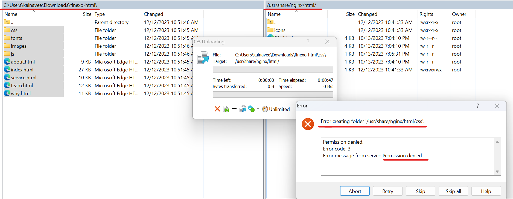
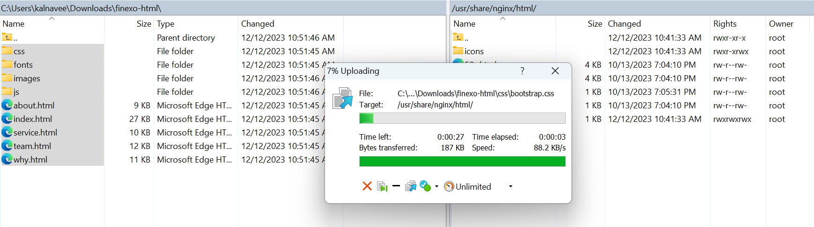
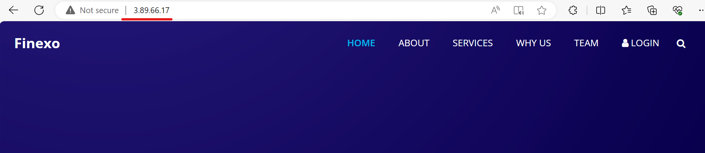

### WinSCP
```
→ Install nginx
[ec2-user@ip-172-31-26-157 ~]$ sudo amazon-linux-extras install nginx1 -y
Installing nginx
```
```
→ start nginx
[ec2-user@ip-172-31-26-157 ~]$ sudo systemctl start nginx
```
```
→ check nginx status
[ec2-user@ip-172-31-26-157 ~]$ ps -ef | grep nginx
root      3965     1  0 05:13 ?        00:00:00 nginx: master process /usr/sbin/                 nginx
nginx     3966  3965  0 05:13 ?        00:00:00 nginx: worker process
ec2-user  3968  3778  0 05:13 pts/1    00:00:00 grep --color=auto nginx
```
```
→ Into Nginx Folder
[ec2-user@ip-172-31-26-157 ~]$ sudo -i
[root@ip-172-31-26-157 ~]# cd /usr/share/nginx/html
[root@ip-172-31-26-157 html]# ls
404.html  50x.html  icons  index.html  nginx-logo.png  poweredby.png
```

### Troubleshooting
```
[root@ip-172-31-26-157 ~]# cd /usr/share/nginx
[root@ip-172-31-26-157 nginx]# ls -l
drwxr-xr-x 3 root root 112 Dec 12 05:11 html
drwxr-xr-x 2 root root   6 Oct 13 13:35 modules

// others having only read-only permission for html folder
[root@ip-172-31-26-157 nginx]# chmod o+w -R html
[root@ip-172-31-26-157 nginx]# ls -l
drwxr-xrwx 3 root root 112 Dec 12 05:11 html
drwxr-xr-x 2 root root   6 Oct 13 13:35 modules
```

