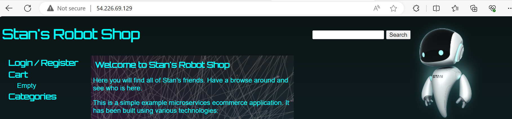
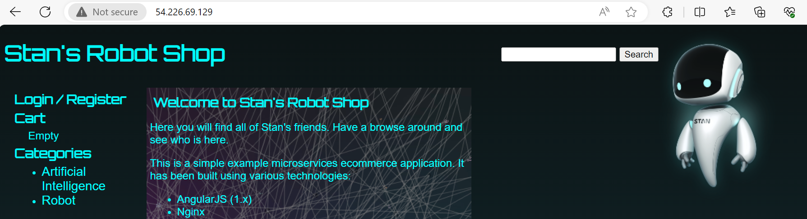
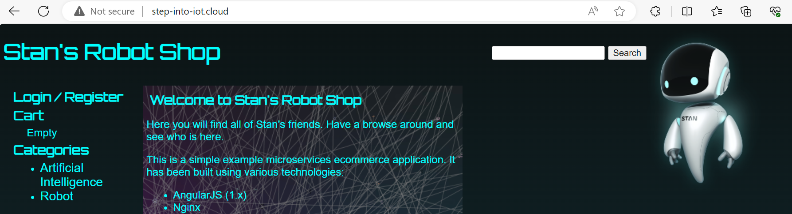
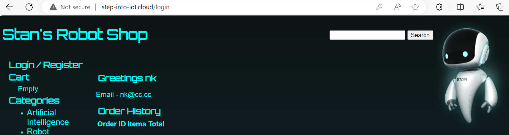
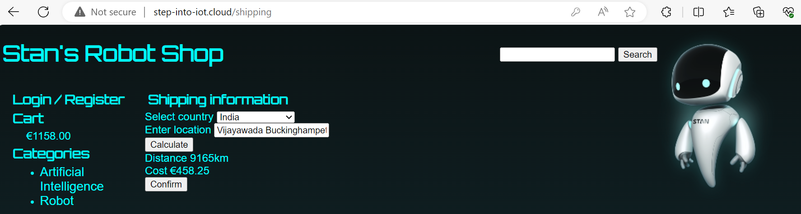
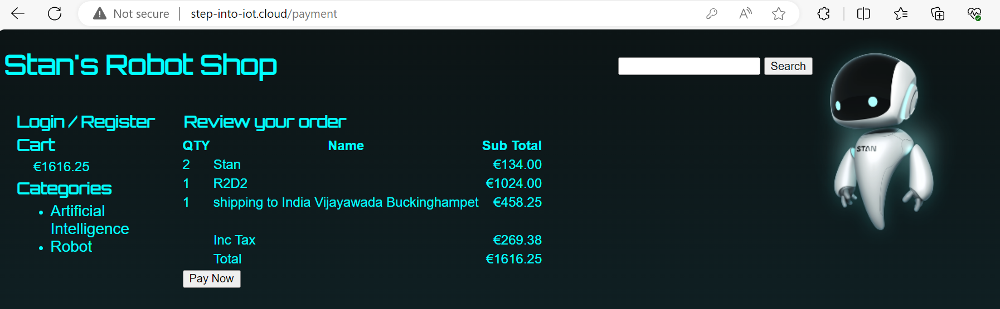
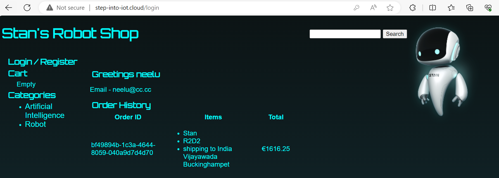
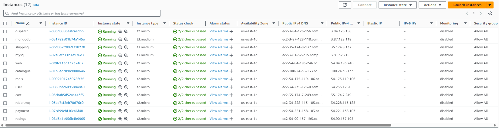
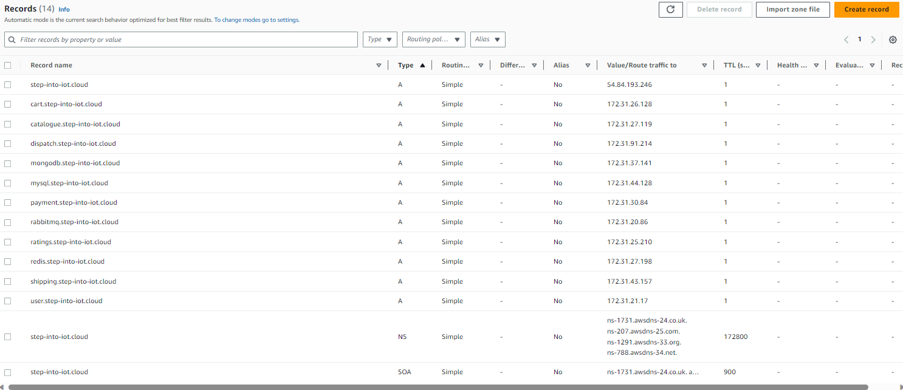

### WEB
```
sudo -i
dnf install nginx -y
check port 80 free or not
systemctl enable nginx
systemctl start nginx
see nginx config file (cat /etc/nginx/nginx.conf)
see nginx default home page (cat /usr/share/nginx/html/index.html)
```
```
[ root@WEB ~ ]# dnf install nginx -y

[ root@WEB ~ ]# systemctl enable nginx
```
#### checking weather port 80 is open or not
```
[ root@WEB ~ ]# netstat -lntp
Active Internet connections (only servers)
Proto Recv-Q Send-Q Local Address           Foreign Address         State       PID/Program name
tcp        0      0 0.0.0.0:111             0.0.0.0:*               LISTEN      1/systemd
tcp        0      0 0.0.0.0:22              0.0.0.0:*               LISTEN      21024/sshd
tcp6       0      0 :::111                  :::*                    LISTEN      1/systemd
tcp6       0      0 :::22                   :::*                    LISTEN      21024/sshd
```
#### port 80 is open, start nginx
```
[ root@WEB ~ ]# systemctl start nginx

[ root@WEB ~ ]# netstat -lntp
Active Internet connections (only servers)
Proto Recv-Q Send-Q Local Address           Foreign Address         State       PID/Program name
tcp        0      0 0.0.0.0:111             0.0.0.0:*               LISTEN      1/systemd
tcp        0      0 0.0.0.0:80              0.0.0.0:*               LISTEN      40259/nginx: master
tcp        0      0 0.0.0.0:22              0.0.0.0:*               LISTEN      21024/sshd
tcp6       0      0 :::111                  :::*                    LISTEN      1/systemd
tcp6       0      0 :::80                   :::*                    LISTEN      40259/nginx: master
tcp6       0      0 :::22                   :::*                    LISTEN      21024/sshd
```
#### Default nginx configuration
```
[ root@WEB ~ ]# cat /etc/nginx/nginx.conf
```
#### Default html page
```
[ root@WEB ~ ]# cat /usr/share/nginx/html/index.html
```
#### Remove Default html page & Download our Application files
```
[ root@WEB ~ ]# rm -rf /usr/share/nginx/html/*

[ root@WEB ~ ]# curl -o /tmp/web.zip https://roboshop-builds.s3.amazonaws.com/web.zip
  % Total    % Received % Xferd  Average Speed   Time    Time     Time  Current
                                 Dload  Upload   Total   Spent    Left  Speed
100 1101k  100 1101k    0     0  9107k      0 --:--:-- --:--:-- --:--:-- 9107k
```
#### go to html folder & unzip downloaded file
```
[ root@WEB ~ ]# cd /usr/share/nginx/html

[ root@WEB /usr/share/nginx/html ]# unzip /tmp/web.zip

[ root@WEB /usr/share/nginx/html ]# ls
cart.html  empty.html  images      js          media         product.html  shipping.html
css        eum.html    index.html  login.html  payment.html  search.html   splash.html
```


### Nginx as reverse proxy
```
Reverse proxy
→ clients are not aware of server side
→ apps use reverse proxy to secure their code
Ex: load balancing

// create robotshop.conf file to configure RobotShop
[ root@WEB /usr/share/nginx/html ]# vi /etc/nginx/default.d/robotshop.conf
```
```
proxy_http_version 1.1;
location /images/ {
  expires 5s;
  root   /usr/share/nginx/html;
  try_files $uri /images/placeholder.jpg;
}
location /api/catalogue/ { proxy_pass http://localhost:8080/; }
location /api/user/ { proxy_pass http://localhost:8080/; }
location /api/cart/ { proxy_pass http://localhost:8080/; }
location /api/shipping/ { proxy_pass http://localhost:8080/; }
location /api/payment/ { proxy_pass http://localhost:8080/; }

location /health {
  stub_status on;
  access_log off;
}
```
```
[ root@WEB /usr/share/nginx/html ]# systemctl restart nginx
```
### ctrl+shift+i
```
we can see errors that it trying to connect to catalog ?
http://54.226.69.129/api/catalogue/categories

lets configure catalogue (but catalogue deponds on mongodb)
```
### mongodb
```
add mongo repository, because it was not by default
install mongodb-org
enable & start mongod
```
```
Create VM with t3.medium, preffer Spot to avoid cost(but not preffered in realtime)

Developer has chosen the database MongoDB.

Hence, we are trying to install it up and configure it.

NOTE: Versions of the DB Software you will get context from the developer, Meaning we need to check with developer. 

Developer has shared the version information as MongoDB-4.x
```
### setup mongodb repo
```
[ centos@MONGO ~ ]$ sudo -i

[ root@MONGO ~ ]# vi /etc/yum.repos.d/mongo.repo
```
```
[mongodb-org-4.2]
name=MongoDB Repository
baseurl=https://repo.mongodb.org/yum/redhat/$releasever/mongodb-org/4.2/x86_64/
gpgcheck=0
enabled=1
```
```
[ root@MONGO ~ ]# dnf install mongodb-org -y 

[ root@MONGO ~ ]# systemctl enable mongod

[ root@MONGO ~ ]# systemctl start mongod
```
#### Important
```
Usually MongoDB opens the port only to localhost(127.0.0.1), meaning this service can be accessed by the application that is hosted on this server only. However, we need to access this service to be accessed by another server(remote server), So we need to change the config accordingly.

Update listen address from 127.0.0.1 to 0.0.0.0 in /etc/mongod.conf to accecept connection from all hosts.
```
```
[ root@MONGO ~ ]# vi /etc/mongod.conf

[ root@MONGO ~ ]# systemctl restart mongod

[ root@MONGO ~ ]# netstat -lntp
Active Internet connections (only servers)
Proto Recv-Q Send-Q Local Address           Foreign Address         State       PID/Program name
tcp        0      0 0.0.0.0:111             0.0.0.0:*               LISTEN      1/systemd
tcp        0      0 0.0.0.0:22              0.0.0.0:*               LISTEN      820/sshd
tcp        0      0 0.0.0.0:27017           0.0.0.0:*               LISTEN      16462/mongod
tcp6       0      0 :::111                  :::*                    LISTEN      1/systemd
tcp6       0      0 :::22                   :::*                    LISTEN      820/sshd
```
### Catalogue
```
Create EC2 with t2.micro

Catalogue is a microservice that is responsible for serving the list of products that displays in roboshop application.

Developer has chosen NodeJs, Check with developer which version of NodeJS is needed. Developer has set a context that it can work with NodeJS >18

Install NodeJS, By default NodeJS 10 is available, We would like to enable 18 version and install list.
```
```
// by default install nodejs version 10
[ root@CATALOGUE ~ ]# dnf module disable nodejs -y

[ root@CATALOGUE ~ ]# dnf module enable nodejs:18 -y

[ root@CATALOGUE ~ ]# dnf install nodejs -y

[ root@CATALOGUE ~ ]# node -v
v18.9.1
```
### I want run application with non root user (Ex: robotshop)
```
[ root@CATALOGUE ~ ]# useradd --system --home /app --shell /sbin/nologin --comment "robotshop system user" robotshop

[ root@CATALOGUE ~ ]# mkdir /app

[ root@CATALOGUE ~ ]# curl -o /tmp/catalogue.zip https://roboshop-builds.s3.amazonaws.com/catalogue.zip
  % Total    % Received % Xferd  Average Speed   Time    Time     Time  Current
                                 Dload  Upload   Total   Spent    Left  Speed
100  3097  100  3097    0     0  25808      0 --:--:-- --:--:-- --:--:-- 25808

[ root@CATALOGUE ~ ]# cd /app

[ root@CATALOGUE /app ]# unzip /tmp/catalogue.zip

[ root@CATALOGUE /app ]# ls
package.json  schema  server.js
```
#### Install dependencies to run Application
```
[ root@CATALOGUE /app ]# npm install
```

### create service for catalogue
#### We need to setup a new service in systemd so systemctl can manage this service
```
[ root@CATALOGUE /app ]# vi /etc/systemd/system/catalogue.service
```
```
[Unit]
Description = Catalogue Service

[Service]
User=robotshop
Environment=MONGO=true
Environment=MONGO_URL="mongodb://172.31.45.231:27017/catalogue"
ExecStart=/bin/node /app/server.js
SyslogIdentifier=catalogue

[Install]
WantedBy=multi-user.target
```
#### optional-change-1
```
[Unit]
Description = Catalogue Service

[Service]
User=robotshop
Environment=MONGO=true
Environment=MONGO_URL="mongodb://mongodb.lookatme.space:27017/catalogue"
ExecStart=/bin/node /app/server.js
SyslogIdentifier=catalogue

[Install]
WantedBy=multi-user.target

# Environment=MONGO_URL="mongodb://mongodb.lookatme.space:27017/catalogue"
# Add A-record in AWS Route 53 with name mongodb

Check private IP address of mongodb instance after creation of A-record
[ root@CATALOGUE /app ]# nslookup mongodb.lookatme.space
```
#### Note: reload daemon to pickup new services
```
[ root@CATALOGUE /app ]# systemctl daemon-reload

[ root@CATALOGUE /app ]# systemctl enable catalogue

[ root@CATALOGUE /app ]# systemctl start catalogue

[ root@CATALOGUE /app ]# netstat -lntp
Active Internet connections (only servers)
Proto Recv-Q Send-Q Local Address           Foreign Address         State       PID/Program name
tcp        0      0 0.0.0.0:111             0.0.0.0:*               LISTEN      1/systemd
tcp        0      0 0.0.0.0:22              0.0.0.0:*               LISTEN      847/sshd
tcp6       0      0 :::111                  :::*                    LISTEN      1/systemd
tcp6       0      0 :::8080                 :::*                    LISTEN      5656/node
tcp6       0      0 :::22                   :::*                    LISTEN      847/sshd
```
### Check logs
```
[ root@CATALOGUE /app ]# tail -f /var/log/messages
--OR--
[ root@CATALOGUE /app ]# cat /var/log/messages | grep MongoDB
Dec 13 02:29:47 CATALOGUE catalogue[5656]: {"level":"info","time":1702434587908,"pid":5656,"hostname":"CATALOGUE.ec2.internal","msg":"MongoDB connected","v":1}
```
### Modify robotshop.conf to pick Catalogue 
```
[ root@WEB ~ ]# vi /etc/nginx/default.d/robotshop.conf

Ex: location /api/catalogue/ { proxy_pass http://172.31.17.24:8080/; }

[ root@WEB ~ ]# systemctl restart nginx
```
#### optional-change-1
```
Create A-Record in AWS Route 53
Ex: location /api/catalogue/ { proxy_pass http://catalogue.lookatme.space:8080/; }

nslookup catalogue.lookatme.space
```
### Load Schema to MongoDB see data in web page
#### we need to install mongodb client
```
[ root@CATALOGUE /app ]# vi /etc/yum.repos.d/mongo.repo

// Add below to mongo.repo
[mongodb-org-4.2]
name=MongoDB Repository
baseurl=https://repo.mongodb.org/yum/redhat/$releasever/mongodb-org/4.2/x86_64/
gpgcheck=0
enabled=1
```
```
[ root@CATALOGUE ~ ]# dnf install mongodb-org-shell -y

[ root@CATALOGUE /app ]# mongo --host 172.31.45.231 < /app/schema/catalogue.js
```
#### optional-change-1
```
mongo --host mongodb.lookatme.space < /app/schema/catalogue.js
```



### errors may occur at these locations
```
web →→ robotshop.conf catalogue IP
catalogue →→ is running or not
			  data loaded to mongodb or not
			  catalogue.service mongodb IP is good or not
mongodb →→ remote 0.0.0.0 allowed or not
firewalls

catalogue →→ mongodb
```
### Redis
```
create EC2 with centos-8, t2.micro
create A-record with name redis.lookatme.space
```
```
[ root@REDIS ~ ]# dnf install https://rpms.remirepo.net/enterprise/remi-release-8.rpm -y

[ root@REDIS ~ ]# dnf module enable redis:remi-6.2 -y

[ root@REDIS ~ ]# dnf install redis -y
```
```
Usually Redis opens the port only to localhost(127.0.0.1), meaning this service can be accessed by the application that is hosted on this server only. However, we need to access this service to be accessed by another server, So we need to change the config accordingly.

Update listen address from 127.0.0.1 to 0.0.0.0 in /etc/redis.conf & /etc/redis/redis.conf
```
```
[ root@REDIS ~ ]# vi /etc/redis.conf

[ root@REDIS ~ ]# systemctl enable redis

[ root@REDIS ~ ]# systemctl start redis
```
#### Important
```
[ root@REDIS ~ ]# netstat -lntp
Active Internet connections (only servers)
Proto Recv-Q Send-Q Local Address           Foreign Address         State       PID/Program name
tcp        0      0 0.0.0.0:6379            0.0.0.0:*               LISTEN      1936/redis-server 0
tcp        0      0 0.0.0.0:111             0.0.0.0:*               LISTEN      1/systemd
tcp        0      0 0.0.0.0:22              0.0.0.0:*               LISTEN      821/sshd
tcp6       0      0 ::1:6379                :::*                    LISTEN      1936/redis-server 0
tcp6       0      0 :::111                  :::*                    LISTEN      1/systemd
tcp6       0      0 :::22                   :::*                    LISTEN      821/sshd
```

#### User
```
user deponds on redis

User is a microservice that is responsible for User Logins and Registrations Service in RobotShop e-commerce portal.

Developer has chosen NodeJs, Check with developer which version of NodeJS is needed. Developer has set a context that it can work with NodeJS >18

Install NodeJS, By default NodeJS 10 is available, We would like to enable 18 version and install list.
```
```
[ root@USER ~ ]# dnf module disable nodejs -y
[ root@USER ~ ]# dnf module enable nodejs:18 -y
[ root@USER ~ ]# dnf install nodejs -y

[ root@USER ~ ]# node -v
v18.9.1
```
```
[ root@USER ~ ]# useradd --system --home /app --shell /sbin/nologin --comment "robotshop system user" robotshop
[ root@USER ~ ]# mkdir /app
[ root@USER ~ ]# curl -L -o /tmp/user.zip https://roboshop-builds.s3.amazonaws.com/user.zip
[ root@USER ~ ]# cd /app
[ root@USER /app ]# unzip /tmp/user.zip

[ root@USER /app ]# cd /app
[ root@USER /app ]# npm install
```
#### We need to setup a new service in systemd so systemctl can manage this service
```
[ root@USER /app ]# vi /etc/systemd/system/user.service
```
```
[Unit]
Description = User Service

[Service]
User=robotshop
Environment=MONGO=true
Environment=REDIS_HOST=redis.lookatme.space
Environment=MONGO_URL="mongodb://mongodb.lookatme.space:27017/users"
ExecStart=/bin/node /app/server.js
SyslogIdentifier=user

[Install]
WantedBy=multi-user.target
```
```
[ root@USER /app ]# systemctl daemon-reload
[ root@USER /app ]# systemctl enable user
[ root@USER /app ]# systemctl start user
```
### Load data into MongoDB
```
For the application to work fully functional we need to load schema to the Database. Then

NOTE: Schemas are usually part of application code and developer will provide them as part of development.

We need to load the schema. To load schema we need to install mongodb client.

To have it installed we can setup MongoDB repo and install mongodb-client
```
```
[ root@USER /app ]# vi /etc/yum.repos.d/mongo.repo
```
```
[mongodb-org-4.2]
name=MongoDB Repository
baseurl=https://repo.mongodb.org/yum/redhat/$releasever/mongodb-org/4.2/x86_64/
gpgcheck=0
enabled=1
```
```
[ root@USER /app ]# dnf install mongodb-org-shell -y
[ root@USER /app ]# mongo --host mongodb.lookatme.space < /app/schema/user.js
```
```
[ root@USER /app ]# cat /var/log/messages | grep -i redis
Dec 13 09:46:52 USER user[2368]: {"level":"info","time":1702460812034,"pid":2368,"hostname":"USER","msg":"Redis READY undefined","v":1}

[ root@USER /app ]# cat /var/log/messages | grep -i mongo
Dec 13 09:46:52 USER user[2368]: (node:2368) [MONGODB DRIVER] Warning: Current Server Discovery and Monitoring engine is deprecated, and will be removed in a future version. To use the new Server Discover and Monitoring engine, pass option { useUnifiedTopology: true } to the MongoClient constructor.
Dec 13 09:46:52 USER user[2368]: {"level":"info","time":1702460812041,"pid":2368,"hostname":"USER","msg":"MongoDB connected","v":1}
```
### Modify RobotShop.conf to pick user
```
[ root@WEB /usr/share/nginx/html ]# vi /etc/nginx/default.d/robotshop.conf

location /api/user/ { proxy_pass http://user.lookatme.space:8080/; }

[ root@WEB /usr/share/nginx/html ]# systemctl restart nginx
```


### Cart
```
Cart deponds on redis

Cart is a microservice that is responsible for Cart Service in RobotShop e-commerce portal.

Developer has chosen NodeJs, Check with developer which version of NodeJS is needed. Developer has set a context that it can work with NodeJS >18

Install NodeJS, By default NodeJS 10 is available, We would like to enable 18 version and install list.
```
```
[ root@CART ~ ]# dnf module disable nodejs -y
[ root@CART ~ ]# dnf module enable nodejs:18 -y
[ root@CART ~ ]# dnf install nodejs -y
[ root@CART ~ ]# node -v
v18.9.1
```
```
[ root@CART ~ ]# useradd --system --home /app --shell /sbin/nologin --comment "robotshop system user" robotshop
[ root@CART ~ ]# mkdir /app
[ root@CART ~ ]# curl -L -o /tmp/cart.zip https://roboshop-builds.s3.amazonaws.com/cart.zip
  % Total    % Received % Xferd  Average Speed   Time    Time     Time  Current
                                 Dload  Upload   Total   Spent    Left  Speed
100  3109  100  3109    0     0  43180      0 --:--:-- --:--:-- --:--:-- 43180

[ root@CART ~ ]# cd /app
[ root@CART /app ]# unzip /tmp/cart.zip
[ root@CART /app ]# npm install
```
### We need to setup a new service in systemd so systemctl can manage this service
```
[ root@CART /app ]# vi /etc/systemd/system/cart.service
```
```
[Unit]
Description = Cart Service
[Service]
User=robotshop
Environment=REDIS_HOST=redis.lookatme.space
Environment=CATALOGUE_HOST=catalogue.lookatme.space
Environment=CATALOGUE_PORT=8080
ExecStart=/bin/node /app/server.js
SyslogIdentifier=cart

[Install]
WantedBy=multi-user.target
```
```
[ root@CART /app ]# systemctl daemon-reload
[ root@CART /app ]# systemctl enable cart
[ root@CART /app ]# systemctl start cart
```
```
[ root@CART /app ]# netstat -lntp
Active Internet connections (only servers)
Proto Recv-Q Send-Q Local Address           Foreign Address         State       PID/Program name
tcp        0      0 0.0.0.0:111             0.0.0.0:*               LISTEN      1/systemd
tcp        0      0 0.0.0.0:22              0.0.0.0:*               LISTEN      834/sshd
tcp6       0      0 :::111                  :::*                    LISTEN      1/systemd
tcp6       0      0 :::8080                 :::*                    LISTEN      2328/node
tcp6       0      0 :::22                   :::*                    LISTEN      834/sshd
```
### Modify RobotShop.conf to pick cart
```
[ root@WEB /usr/share/nginx/html ]# vi /etc/nginx/default.d/robotshop.conf

Ex: location /api/cart/ { proxy_pass http://cart.lookatme.space:8080/; }

[ root@WEB /usr/share/nginx/html ]# systemctl restart nginx
```


### MySql
```
Developer has chosen the database MySQL. Hence, we are trying to install it up and configure it.

CentOS-8 Comes with MySQL 8 Version by default, However our application needs MySQL 5.7. So lets disable MySQL 8 version.
```
```
[ root@MYSQL ~ ]# dnf module disable mysql -y
```
### Setup the MySQL5.7 repo file
```
[ root@MYSQL ~ ]# vi /etc/yum.repos.d/mysql.repo
```
```
[mysql]
name=MySQL 5.7 Community Server
baseurl=http://repo.mysql.com/yum/mysql-5.7-community/el/7/$basearch/
enabled=1
gpgcheck=0
```
```
[ root@MYSQL ~ ]# dnf install mysql-community-server -y
[ root@MYSQL ~ ]# systemctl enable mysqld
[ root@MYSQL ~ ]# systemctl start mysqld
```
```
Next, We need to change the default root password in order to start using the database service. Use password RoboShop@1 or any other as per your choice.
```
```
[ root@MYSQL ~ ]# mysql_secure_installation --set-root-pass RobotShop@1
```
### Check MySql is working or not
```
[ root@MYSQL ~ ]# mysql -uroot -pRobotShop@1
Server version: 5.7.44 MySQL Community Server (GPL)
mysql>
```
### Shipping
```
Shipping service is responsible for finding the distance of the package to be shipped and calculate the price based on that.

Shipping service is written in Java, Hence we need to install Java.

Maven is a Java Packaging software, Hence we are going to install maven, This indeed takes care of java installation.
```
```
[ root@SHIPPING ~ ]# dnf install maven -y

[ root@SHIPPING ~ ]# useradd --system --home /app --shell /sbin/nologin --comment "robotshop system user" robotshop

[ root@SHIPPING ~ ]# mkdir /app

[ root@SHIPPING ~ ]# curl -L -o /tmp/shipping.zip https://roboshop-builds.s3.amazonaws.com/shipping.zip
  % Total    % Received % Xferd  Average Speed   Time    Time     Time  Current
                                 Dload  Upload   Total   Spent    Left  Speed
100 15.5M  100 15.5M    0     0  40.6M      0 --:--:-- --:--:-- --:--:-- 40.6M

[ root@SHIPPING ~ ]# cd /app

[ root@SHIPPING /app ]# unzip /tmp/shipping.zip
```
```
Every application is developed by development team will have some common softwares that they use as libraries. This application also have the same way of defined dependencies in the application configuration.

Lets download the dependencies & build the application
```
```
[ root@SHIPPING /app ]# cd /app
[ root@SHIPPING /app ]# mvn clean package
[ root@SHIPPING /app ]# mv target/shipping-1.0.jar shipping.jar
```
### We need to setup a new service in systemd so systemctl can manage this service
```
[ root@SHIPPING /app ]# vi /etc/systemd/system/shipping.service
```
```
[Unit]
Description=Shipping Service

[Service]
User=robotshop
Environment=CART_ENDPOINT=cart.lookatme.space:8080
Environment=DB_HOST=mysql.lookatme.space
ExecStart=/bin/java -jar /app/shipping.jar
SyslogIdentifier=shipping

[Install]
WantedBy=multi-user.target
```
```
[ root@SHIPPING /app ]# systemctl daemon-reload
[ root@SHIPPING /app ]# systemctl enable shipping
[ root@SHIPPING /app ]# systemctl start shipping
```
### Install MySql client in shipping to load data
```
For this application to work fully functional we need to load schema to the Database.

We need to load the schema. To load schema we need to install mysql client.
```
```
[ root@SHIPPING /app ]# dnf install mysql -y
[ root@SHIPPING /app ]# mysql -h mysql.lookatme.space -uroot -pRobotShop@1 < /app/schema/shipping.sql
```
```
This service needs a restart because it is dependent on schema, After loading schema only it will work as expected, Hence we are restarting this service. This
```
### check weather data loaded or not
```
[ root@MYSQL ~ ]# mysql -uroot -pRoboShop@1
mysql> show databases;
+--------------------+
| Database           |
+--------------------+
| information_schema |
| cities             |
| mysql              |
| performance_schema |
| sys                |
+--------------------+
```
### restat shipping application
```
[ root@SHIPPING /app ]# systemctl restart shipping
```

### Modify robotshop.config to pick shipping
```
[ root@WEB /usr/share/nginx/html ]# vi /etc/nginx/default.d/robotshop.conf

[ root@WEB /usr/share/nginx/html ]# systemctl restart nginx
```



### RabbitMQ
```
RabbitMQ is a messaging Queue which is used by some components of the applications.
```

#### Configure YUM Repos from the script provided by vendor.
```
[ root@RABBITMQ ~ ]# curl -s https://packagecloud.io/install/repositories/rabbitmq/erlang/script.rpm.sh | bash
```
#### Configure YUM Repos for RabbitMQ.
```
[ root@RABBITMQ ~ ]# curl -s https://packagecloud.io/install/repositories/rabbitmq/rabbitmq-server/script.rpm.sh | bash
```
```
[ root@RABBITMQ ~ ]# dnf install rabbitmq-server -y
[ root@RABBITMQ ~ ]# systemctl enable rabbitmq-server
[ root@RABBITMQ ~ ]# systemctl start rabbitmq-server
```
#### RabbitMQ comes with a default username / password as guest/guest. But this user cannot be used to connect. Hence, we need to create one user for the application.
```
[ root@RABBITMQ ~ ]# rabbitmqctl add_user robotshop robotshop123

Adding user "robotshop" ...

[ root@RABBITMQ ~ ]# rabbitmqctl set_permissions -p / robotshop ".*" ".*" ".*"

Setting permissions for user "robotshop" in vhost "/" ...
```
### Payment
```
This service is responsible for payments in RobotShop e-commerce app. This service is written on Python 3.6, So need it to run this app.
```
```
[ root@PAYMENT ~ ]# dnf install python36 gcc python3-devel -y
```
```
[ root@PAYMENT ~ ]# useradd --system --home /app --shell /sbin/nologin --comment "robotshop system user" robotshop
[ root@PAYMENT ~ ]# mkdir /app
[ root@PAYMENT ~ ]# curl -L -o /tmp/payment.zip https://roboshop-builds.s3.amazonaws.com/payment.zip
  % Total    % Received % Xferd  Average Speed   Time    Time     Time  Current
                                 Dload  Upload   Total   Spent    Left  Speed
100  3518  100  3518    0     0  60655      0 --:--:-- --:--:-- --:--:-- 61719
[ root@PAYMENT ~ ]# cd /app
[ root@PAYMENT /app ]# unzip /tmp/payment.zip
```
```
Every application is developed by development team will have some common softwares that they use as libraries. This application also have the same way of defined dependencies in the application configuration.
```
```
[ root@PAYMENT /app ]# pip3.6 install -r requirements.txt
```
#### We need to setup a new service in systemd so systemctl can manage this service
```
[ root@PAYMENT /app ]# vi /etc/systemd/system/payment.service
```
```
[Unit]
Description=Payment Service

[Service]
User=root
WorkingDirectory=/app
Environment=CART_HOST=cart.lookatme.space
Environment=CART_PORT=8080
Environment=USER_HOST=user.lookatme.space
Environment=USER_PORT=8080
Environment=AMQP_HOST=rabbitmq.lookatme.space
Environment=AMQP_USER=robotshop
Environment=AMQP_PASS=roboshop123

ExecStart=/usr/local/bin/uwsgi --ini payment.ini
ExecStop=/bin/kill -9 $MAINPID
SyslogIdentifier=payment

[Install]
WantedBy=multi-user.target
```
```
[ root@PAYMENT /app ]# systemctl daemon-reload
[ root@PAYMENT /app ]# systemctl enable payment
[ root@PAYMENT /app ]# systemctl start payment
```
### Edit RobotShop.config to pick payment
```
[ root@WEB /usr/share/nginx/html ]# vi /etc/nginx/default.d/robotshop.conf

Ex: location /api/payment/ { proxy_pass http://payment.lookatme.space:8080/; }

[ root@WEB /usr/share/nginx/html ]# systemctl restart nginx
```



### Dispatch
```
Dispatch is the service which dispatches the product after purchase. It is written in GoLang, So wanted to install GoLang.
```
```
[ root@DISPATCH ~ ]# dnf install golang -y
```
```
[ root@DISPATCH ~ ]# useradd --system --home /app --shell /sbin/nologin --comment "robotshop system user" robotshop
[ root@DISPATCH ~ ]# mkdir /app
[ root@DISPATCH ~ ]# curl -L -o /tmp/dispatch.zip https://roboshop-builds.s3.amazonaws.com/dispatch.zip
  % Total    % Received % Xferd  Average Speed   Time    Time     Time  Current
                                 Dload  Upload   Total   Spent    Left  Speed
100  2070  100  2070    0     0  20909      0 --:--:-- --:--:-- --:--:-- 20909
[ root@DISPATCH ~ ]# cd /app
[ root@DISPATCH /app ]# unzip /tmp/dispatch.zip
```
#### Every application is developed by development team will have some common softwares that they use as libraries. This application also have the same way of defined dependencies in the application configuration.
```
[ root@DISPATCH /app ]# cd /app
[ root@DISPATCH /app ]# go mod init dispatch
[ root@DISPATCH /app ]# go get
[ root@DISPATCH /app ]# go build
```
#### We need to setup a new service in systemd so systemctl can manage this service
```
[ root@DISPATCH /app ]# vi /etc/systemd/system/dispatch.service
```
```
[Unit]
Description = Dispatch Service
[Service]
User=roboshop
Environment=AMQP_HOST=rabbitmq.lookatme.space
Environment=AMQP_USER=robotshop
Environment=AMQP_PASS=roboshop123
ExecStart=/app/dispatch
SyslogIdentifier=dispatch

[Install]
WantedBy=multi-user.target
```
```
[ root@DISPATCH /app ]# systemctl daemon-reload
[ root@DISPATCH /app ]# systemctl enable dispatch
[ root@DISPATCH /app ]# systemctl start dispatch
```


